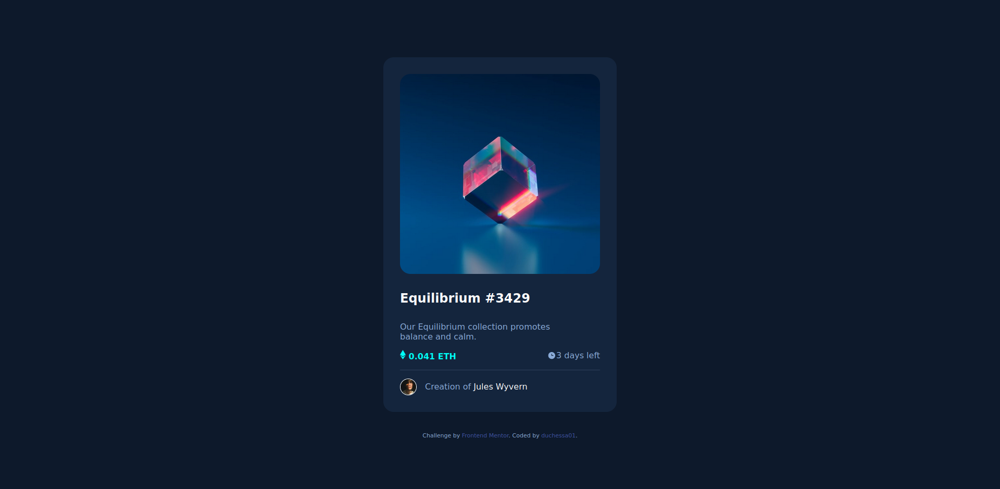

# NFT Preview Card Component | Frontend Mentor

This is a solution to the [NFT preview card component challenge on Frontend Mentor](https://www.frontendmentor.io/challenges/nft-preview-card-component-SbdUL_w0U). 

## Table of contents

- [Overview](#overview)
  - [The challenge](#the-challenge)
  - [Screenshot](#screenshot)
  - [Links](#links)
- [My process](#my-process)
  - [Built with](#built-with)
  - [What I learned](#what-i-learned)
- [Author](#author)

## Overview

### The challenge

Users should be able to:

- View the optimal layout depending on their device's screen size
- See hover states for interactive elements

### Screenshot

### Links

- Solution URL: [Code on GitHub](https://your-solution-url.com)
- Live Site URL: [Live Site](https://your-live-site-url.com)

## My process

### Built with

- Semantic HTML5 markup
- CSS custom properties

### What I learned

I wanted the product's image on the HTML document and inside no more than one element. 
The solution for me was in the use of the ::after selector.

## Author

- Frontend Mentor - [@duchessa01](https://www.frontendmentor.io/profile/duchessa01)
- GitHub - [@duchessa01](https://www.github.com/duchessa01)

